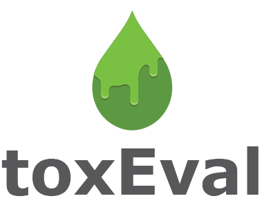

# toxEval 

[](https://cran.r-project.org/package=toxEval)
[](https://cran.r-project.org/package=toxEval)
[](https://cran.r-project.org/package=toxEval)

The `toxEval` R-package includes a set of functions to analyze,
visualize, and organize measured concentration data as it relates to
<https://www.epa.gov/chemical-research/toxicity-forecasting> or other
user-selected chemical-biological interaction benchmark data such as
water quality criteria. The intent of these analyses is to develop a
better understanding of the potential biological relevance of
environmental chemistry data. Results can be used to prioritize which
chemicals at which sites may be of greatest concern. These methods are
meant to be used as a screening technique to predict potential for
biological influence from chemicals that ultimately need to be validated
with direct biological assays.

The functions within this package allow great flexibly for exploring the
potential biological affects of measured chemicals. Also included in the
package is a browser-based application made from the `Shiny` R-package
(the app). The app is based on functions within the R-package and
includes many convenient analyses and visualization options for users to
choose. Use of the functions within the R-package allows for additional
flexibility within the functions beyond what the app offers and provides
options for the user to interact more directly with the data. The
overview in this document focuses on the R-package.

Documentation: <https://doi-usgs.github.io/toxEval/>

## Installation of toxEval

To install the toxEval package, you must be using R 3.0 or greater and
run the following command:

``` r
install.packages("toxEval")
```

To get cutting-edge changes, install from GitHub using the `remotes`
packages:

``` r
library(remotes)
install_gitlab("water/toxEval",
               host = "code.usgs.gov",
               build_vignettes = TRUE, 
               build_opts = c("--no-resave-data",
                              "--no-manual"))
```

## Citing toxEval

``` r
citation(package = "toxEval")
#> 
#> To cite toxEval in publications, please use:
#> 
#>   De Cicco, L.A., Corsi, S.R., Villeneuve D.L, Blackwell, and B.R,
#>   Ankley, G.T., 2023, toxEval: Evaluation of measured concentration
#>   data using the ToxCast high-throughput screening database or a
#>   user-defined set of concentration benchmarks. R package version
#>   1.3.0., https://code.usgs.gov/water/toxEval, doi:10.5066/P906UQ5I
#> 
#> A BibTeX entry for LaTeX users is
#> 
#>   @Manual{,
#>     author = {Laura A. {De Cicco} and Steven R. Corsi and Daniel L. Villeneuve and Brett R. Blackwell and Gerald T. Ankley},
#>     title = {toxEval: Evaluation of measured concentration data using the ToxCast high-throughput screening database or a user-defined set of concentration benchmarks.},
#>     publisher = {U.S. Geological Survey},
#>     version = {1.3.0},
#>     address = {Reston, VA},
#>     institution = {U.S. Geological Survey},
#>     year = {2023},
#>     doi = {10.5066/P906UQ5I},
#>     url = {https://code.usgs.gov/water/toxEval},
#>   }
```

# Disclaimer

This software is preliminary or provisional and is subject to revision.
It is being provided to meet the need for timely best science. The
software has not received final approval by the U.S. Geological Survey
(USGS). No warranty, expressed or implied, is made by the USGS or the
U.S. Government as to the functionality of the software and related
material nor shall the fact of release constitute any such warranty. The
software is provided on the condition that neither the USGS nor the U.S.
Government shall be held liable for any damages resulting from the
authorized or unauthorized use of the software.
